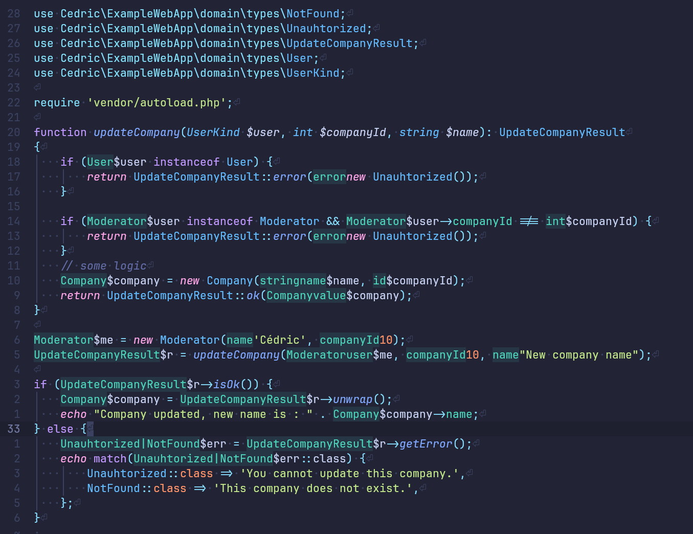

<div align="center">
<h1 align="center">Variant</h1>
  <p align="center">
    A simple ValueObject and ResultType generator for PHP
    <br />
  </p>
</div>

## About The Project



Creating Value Objects or Result Types in PHP can be time-consuming compared to creating custom types in other languages. Variant aims to simplify this process by providing a custom, easy-to-use language for prototyping them.

Here's an example of how a type can be generated with Variant:
```go
type UserKind {
	User(string name, int companyId)
	Moderator(string name, int companyId)
	Admin(string name)
}

type UpdateError {
	Unauhtorized
	NotFound
}

record Company(string name, int id)

result UpdateCompanyResult(Company, UpdateError)
```

## Getting Started

This is an example of how you may give instructions on setting up your project locally.
To get a local copy up and running follow these simple example steps.


### Installation

```sh
composer require cedriccourteau/variant
```


## Usage

1. Add a file with the `.variant` extension the desired folder, such as `src/Users/Types/users.variant`
2. Define your types in this file
3. Launch `php ./vendor/bin/variant`
4. Voilà

## Syntax of `.variant` files

### Overview

```go
type UserKind {
    User(string name, int companyId)
    Moderator(string name, int companyId)
    Admin(string name)
}

type GetUserError{
    NotFound
    InvalidCredentials
    Unauthorized
    BusyDB
}

result GetUserResult(UserKind, GetUserError)
```

### Available instructions

### record

Hold a single ValueObject with custom constructor.
Everything between the parenthesis are like in php but without the `$` for param declaration.

```go
record <NAME>(<TYPE> <ARG_NAME>, etc)
```

#### type

It encapsulates records into a global type, translated into a `Interface`.
Between the `{}` you add custom variants for this type
```go
type <NAME> {
  <VARIANT_NAME>
  <VARIANT_NAME>(<TYPE> <ARG_NAME>, ...)
}
```
### result

Create a custom Result type with an `Ok` value and an `Error` type.
```go
result <RESULT_NAME>(<OK_TYPE>, <ERROR_TYPE>)
```

If the `ERROR_TYPE` is a defined type in the current `.variant` file, it binds the type to a type union of all of its variants.

Example:
```go
type GetUserError{
    NotFound
    InvalidCredentials
    Unauthorized
    BusyDB
}

# It will translate GetUserError onto NotFound|InvalidCredentials|Unauthorized|BusyDB
result GetUserResult(UserKind, GetUserError)
```

## Cli options
```
Options:
  --force          Force mode; recreate files even if they exist.
  --path=<path>    Specify the path to search in (default: src/).
  --namespace=<ns> Specify the namespace to use.
  --help           Display this help message.
```
## Contributing

Contributions are welcome! Feel free to fork, use, and improve the project.

## License

Distributed under the MIT License.
Fork it, use it, make it better.
